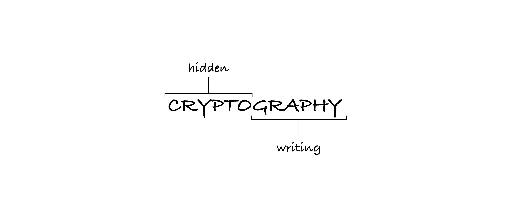
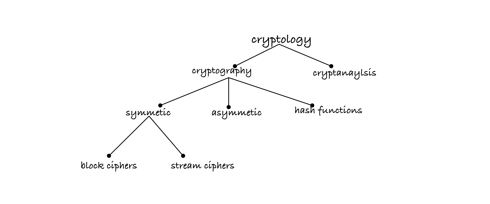
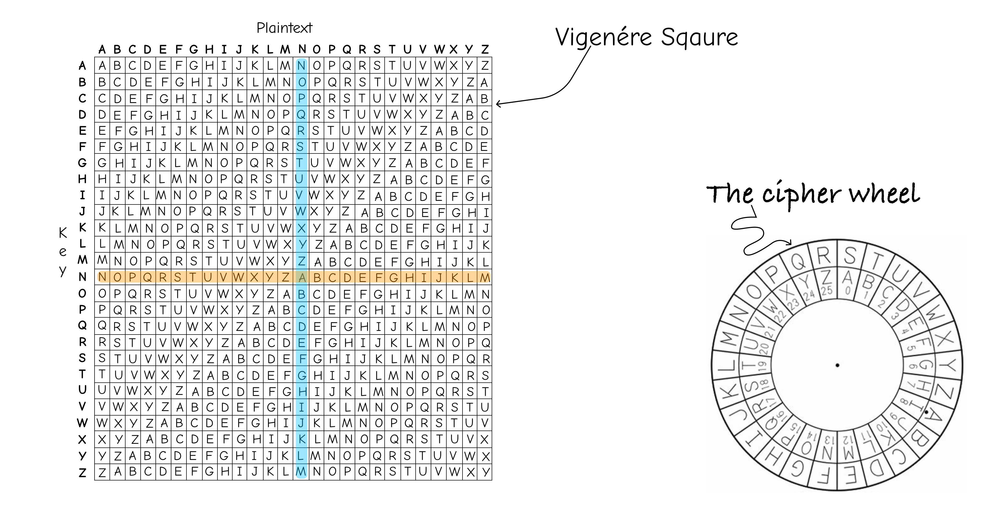
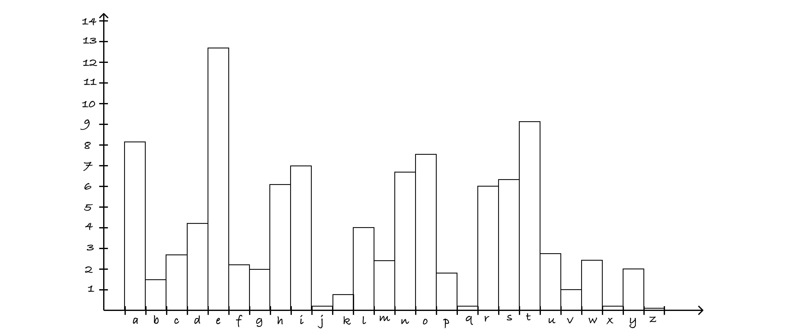
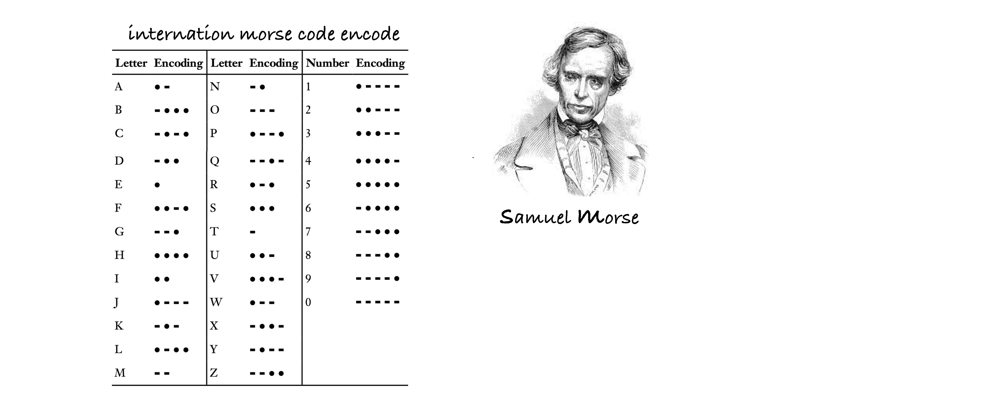
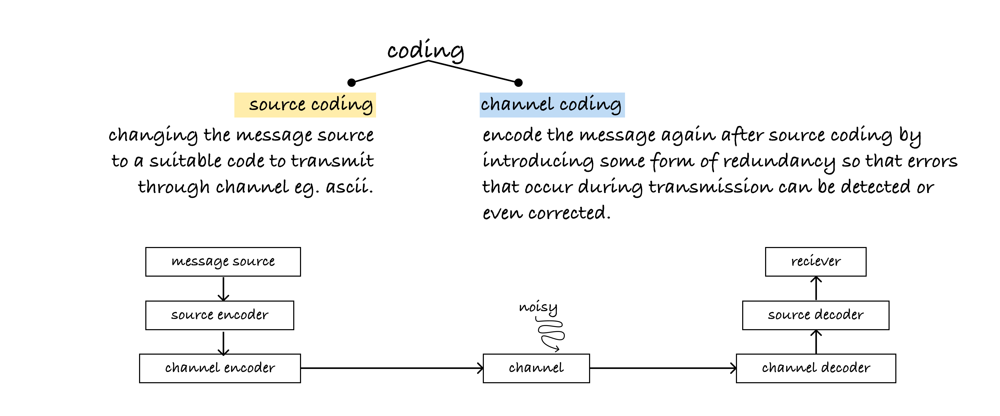

# Cryptology and Coding Theory




Cryptography broken down into:
- `Transposition`
- `Substitution`

### Codes ≠ Ciphers ≠ Nomenclators
`Codes`: systems in which individual words, phrases, or even whole sentences are replaced with specific code words or symbols.

`Ciphers`: cryptographic techniques that involve the transformation of individual characters or blocks of characters in a systematic way.

`Nomenclators`: specific type of code used for secret communication.

### Code Types

- monoalphabetic
- Polyalphabetic

### Common Ciphers

- Caesar’s Cipher
- Vigenere Cipher
- Enigma Cipher
- AES (Variant of Rijndael)



`Good to Know`: Keyspace is the entire range of values that can be used to construct an individual key

### Types of Encryption
- Symmetric Encryption (Private encryption)
    - DES, 3DES
    - AES (Rijndael)
    - Blowfish
- Asymmetric Encryption (Public encryption)
    - ECC (Elliptic Curve Crytography)
    - RSA
    - Diffie-Hellman Key Exchange
    - The ElGamal public-key encryption scheme


### Letter frequency
Letter frequency analysis is a fundamental technique in cryptography used to analyze and break substitution ciphers, particularly monoalphabetic ciphers. It's based on the observation that in most languages, certain letters and combinations of letters appear with different frequencies. forexample in the english language, `e` is the most common letter and `the` is the most common word. [Alpha Frequency](https://raw.githubusercontent.com/hackerb9/gwordlist/master/frequency-alpha-alldicts.txt), related `Google Web Trillion Word Corpus`




#### Assignment 2
Create a Python program that encrypts and decrypts given text using the Caesar cipher. A user should be prompted for input i.e. the text to encrypt/decrypt and the key (number of shifts to make).

```python

def caesar_cipher(text, key, mode):
    """
    Encrypts or decrypts a given text using the Caesar cipher.

    :param text (str): The text to be encrypted or decrypted.
    :param key (int): The key (number of shifts) to be used for encryption or decryption.
    :param mode (str): The mode of operation, either 'encrypt' or 'decrypt'.

    :return (str): The encrypted or decrypted text.
    """
    result = ""
    for char in text:
        if char.isalpha():
            shift = key % 26
            if char.islower():
                if mode == 'encrypt':
                    shifted_char = chr(((ord(char) - ord('a') + shift) % 26) + ord('a'))
                elif mode == 'decrypt':
                    shifted_char = chr(((ord(char) - ord('a') - shift) % 26) + ord('a'))
            elif char.isupper():
                if mode == 'encrypt':
                    shifted_char = chr(((ord(char) - ord('A') + shift) % 26) + ord('A'))
                elif mode == 'decrypt':
                    shifted_char = chr(((ord(char) - ord('A') - shift) % 26) + ord('A'))
        else:
            shifted_char = char
        
        result += shifted_char

    return result

def main():
    while True:
        print("Caesar Cipher")
        print("1. Encrypt")
        print("2. Decrypt")
        print("3. Quit")
        choice = input("Enter your choice (1/2/3): ")

        if choice == '1':
            text = input("Enter the text to encrypt: ")
            key = int(input("Enter the key (number of shifts): "))
            encrypted_text = caesar_cipher(text, key, 'encrypt')
            print("Encrypted text:", encrypted_text)
        elif choice == '2':
            text = input("Enter the text to decrypt: ")
            key = int(input("Enter the key (number of shifts): "))
            decrypted_text = caesar_cipher(text, key, 'decrypt')
            print("Decrypted text:", decrypted_text)
        elif choice == '3':
            print("Goodbye!")
            break
        else:
            print("Invalid choice. Please enter 1, 2, or 3.")

if __name__ == "__main__":
    main()

```





# Coding Theory
(Not directly related to cryptology)

**Coding Theory** is a branch of mathematics concerned with *transmitting data across noisy channels* and *recovering the messages*.

#### Tasks
- Detect errors
- or even Correct errors



`Parity code` in coding theory is a type of error-detecting code that is used to detect errors in data transmission or storage. It involves adding an extra bit (or more) to a block of data to ensure that the total number of bits in the block, including the extra bits, adheres to a specific parity rule. The parity bit only detects errors.

`Channels`: physical medium through which information is stored or transmitted

`Noise`: any unwanted or random interference or distortion that affects the transmission or storage of data e.g. rain, lighting.

### Coding Methods
- Backward Error Correction
    - Receiver only detects the errors
- Forward Error Correction
    - Receiver corrects a certain amount of errors.

### Channel coding goals
- fast encoding messages
- Easy transmission of encoded messages
- Fast decoding of received messages
- Maximum transfer of information


### Movie Recommendations (Purely entertainment)
- Beautiful Mind
- Imitation Game
- Mr. Robot


### References

<div style="display: flex; justify-content: space-between;">

[](https://www.youtube.com/watch?v=jhXCTbFnK8o "PBS Cryptography")

[](https://www.youtube.com/watch?v=9pp9YpginNg "History of Cryptography")

</div>
