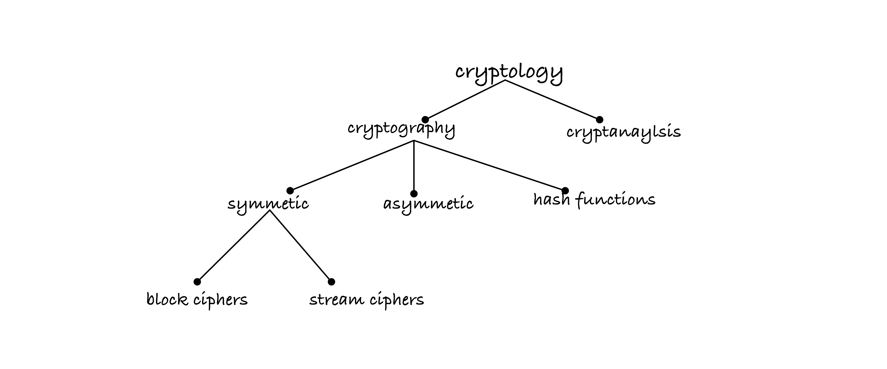

# CSC3114 Cryptology and Coding Theory

Cryptology = cryptography + cryptanalysis

Cryptography broken down into:
- `Transposition`
- `Subsitition`

Codes ≠ Ciphers ≠ Nomenclators

### Code Types

- monoalphabetic
- Polyalphabetic

### Common Ciphers

- Caesar’s Cipher
- Vigenere Square
- Enigma Cipher
- AES (Variant of Rijndae)

### References

